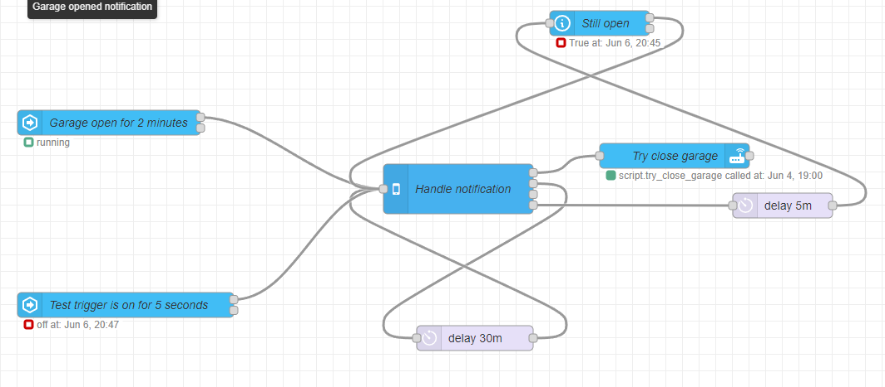
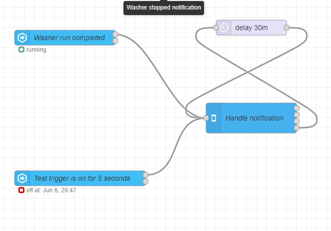

# Send notification when garage open > 2min v2

[Node-Red HACS addon](https://github.com/hassio-addons/addon-node-red) with [flow](/homeassistant/node-red/flows.json) utilizing [Android actionable notification](https://zachowj.github.io/node-red-contrib-home-assistant-websocket/cookbook/actionable-notifications-subflow-for-android.html) subflow.

## Garage opened notification

## Washer stopped notification

## Configuration for [GarminHomeAssistant app](https://apps.garmin.com/en-US/apps/61c91d28-ec5e-438d-9f83-39e9f45b199d)
[menu.json](./www/garmin/menu.json)  